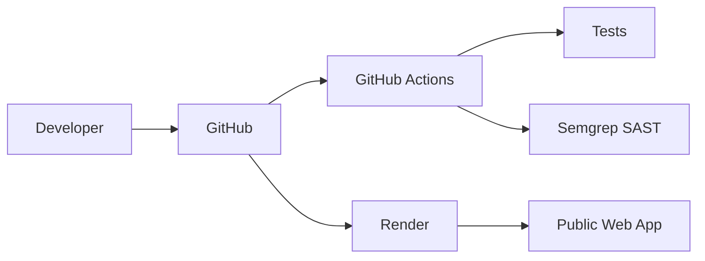

# Secure Notes DevSecOps

## Description
This is an educational application designed to demonstrate DevSecOps practices, including SAST (Static Application Security Testing), secure coding, CI/CD with GitHub Actions, automated vulnerability scanning, and cloud deployment. 

The application itself is intentionally simple—a note-taking app—to focus entirely on the DevSecOps workflow.

## Architecture


## Technologies
| Category | Technology |
|---|---|
| Backend | Python 3.12, Flask |
| Database | SQLite |
| SAST | Semgrep |
| CI/CD | GitHub Actions |
| Cloud | Render |

## Features
- Create notes with validation.
- Search notes securely using parameterized queries.
- Delete notes (POST requests only).
- SAST scanning in local environment and CI pipeline.
- Automated deployment to cloud provider.

## Local Installation
```bash
git clone [ADD GITHUB URL]
cd secure-notes-devsecops

# Create virtual environment
python -m venv venv

# Activate (Windows)
venv\Scripts\activate
# Activate (Linux/macOS)
# source venv/bin/activate

# Install dependencies
pip install -r requirements.txt

# Run application
python app.py
```
Open [http://localhost:5000](http://localhost:5000)

## Security Scan
Install and run Semgrep locally to detect insecure patterns:
```bash
pip install semgrep
semgrep --config auto --config .semgrep.yml .
```

## Security Demonstration
The repository contains an educational vulnerability example to demonstrate how a tool like Semgrep detects security flaws.
- **Vulnerable Code**: Located in `examples/vulnerable_example.py`
- **Expected Finding**: Potential SQL Injection due to string concatenation.
- **Fix**: Replaced concatenated strings with parameterized SQLite queries in the main application flow.

## GitHub Actions
The CI pipeline automatically runs on every push and pull request. Check it at:
`Repository -> Actions -> Security Scan - Semgrep`

## Deployment
Deployed via Render:
`GitHub -> Render Web Service -> Public URL`

## Public Links
- **Repository**: [https://github.com/USERNAME/secure-notes-devsecops](https://github.com/USERNAME/secure-notes-devsecops)
- **Live Application**: [https://YOUR-APP.onrender.com](https://your-app.onrender.com)
- **Article**: TO BE ADDED
- **Video**: TO BE ADDED

## Screenshots
*(Images to be added to the evidence folder)*
- `01-home.png`
- `02-create-note.png`
- `03-semgrep-finding.png`
- `04-code-fix.png`
- `05-github-actions.png`
- `06-render-deploy.png`

---
*This application was created for educational purposes to demonstrate automated vulnerability scanning and DevSecOps practices.*
